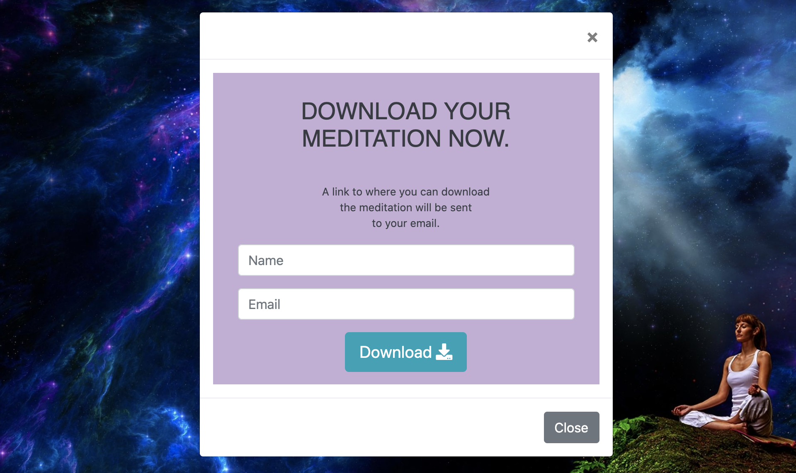

[View the website in GitHub Pages ](https://marc-solution.github.io/marco-deb/)

# Table of contents

1. [Marco Deb](#Marco Deb)
    
    - A short description of this website
    - There is two types of customer we aim for

2. [Ux](#ux)
   - The business goals for this website.
   - The user goals website.
   - User stories.
   - Wireframes.
   - Design choises.

3. [Features](#features)
   - Existing features.
   - Features left to implement.
   - Technologies used.
   - New features added after testing.

4. [Testing](#testing)

5. [Deployment](#deployment)
    - GitHub Pages.
    - How to download the project.
    - How to clone the project.

6. [Credits](#credits)
    - Code.
    - Content.
    - Media.
    - Acknowledgements.

    # Marco Deb

### A short description of this website

# UX

#### The business goals for this website are:

- Sell products
- Raise brand awareness
- Connect to customers
- Get peoples emails

#### The customer goals for this website are:

User stories: 

As a visitor to this website I want to…

- know what this website can offer me?
- learn about health
- learn about breathing
- learn about meditation
- learn about mental training
- learn about Mental health
- enroll in courses about physical and mental health
- find books about mental training, meditation and health.
- know about product prices
- easily navigate this website
- know learn about Marco Deb

### Wireframe mockups:

For wireframing I used [Balsamiq](https://balsamiq.com)

Click this link to see my wireframes.

<https://marc-solution.github.io/mavera-wireframes/>

### Design choices

I wanted the design to be simple and calming. Therefor I chose images of nature and images of meditation. The reason I have images of people doing meditation is to let them know that this website is about meditation and personal development.

# Features

### Existing Features

### All pages contains:

- A responsive navbar with links to each respective page on the website, exept for the terms and privacy policy pages. There are links to these pages in the footer. The navbar is on the top of the page in all pages.
- The logo in the navbar. Clicking the logo returns users to the home page
- A banner image with nature and meditation.
- A Footer on all pages with links to navigate the website,Links to terms and privacy policy pages, contact information, a contact form and social media links. social media links. The social media links opens a new tab in the browser. The footer is in the bottom of all pages.

- The option to change background color on all product pages, terms page, privacy policy page and about page. The user has the option to choose between dark or light background themes. The color of the text also changes when changing theme. The settings the user chooses are stored in the local storage.

- The option to choose font size on all product pages, terms page, privacy policy page and about page. The user has the option to choose between three different font sizes. Small, medium or large. The settings the user chooses are stored in the local storage.

- Download a meditation. The user can fill in his or her name and email address. They will receive an email containing a link to download the meditation. The service used to provide this feature is Emailjs.com

- Customer Guide. A guide to help the user to find what they’re looking for. 
    - The purpose of this feature is to help the user to easier find what they are looking for.
    - The user is asked the question “ What are you looking to elevate?”  The is presented with three categories to choose from. Mind, Body or Business.  
    - When the user chooses one category, products will be shown that hopefully will satisfy the users needs.
    - The idea is that this feature can evolve into some kind of survey that will guide the user to find products that best fulfills their needs.

## Home page

Contents of the home page:

- On the home page there is a large banner image of A person meditation in beautiful nature. The purpose is that the user instantly will know that this page is about meditation and personal development. There’s text on the banner image that reveals that this website offers courses, books and meditations. (See image below)

- After the banner image there’s a section with the headline “HERE’S HOW MARCO CAN HELP” After that there’s three cards. One for Courses, One for Books and One for Meditations. Each card has a button. Clicking the button will lead the user to a products page. (See image below)

- Download a meditation section. In this section the user can download a free meditation. There’s a short text describing the meditation followed by a download button. When clicking the button a modal popup opens. In the modal the user can fill in a form that asks for the users name and email address. After submitting, a download link will be sent to the email address the user gave. (See image below)

- Customer guide. A section that is intended to help the user find what product that will fulfill their needs.

- A footer with links to navigate the website, social media links, contact information and a contact form.

