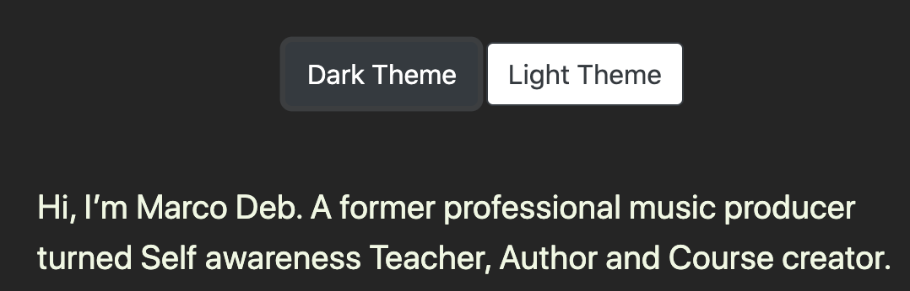
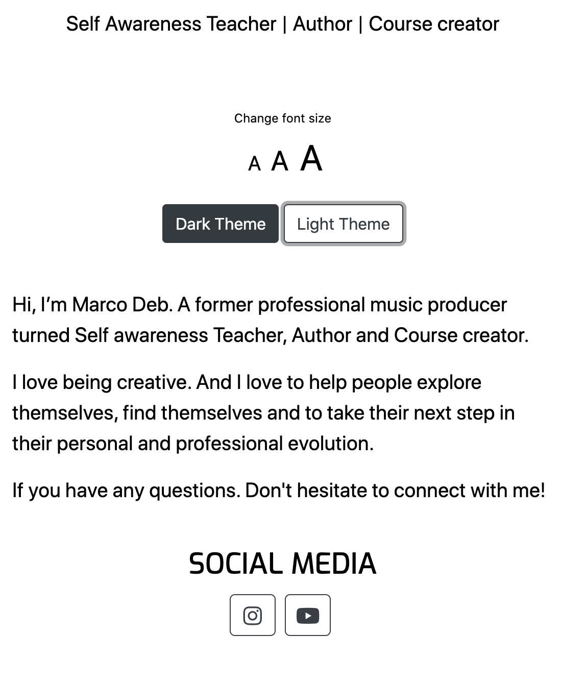

[View the website in GitHub Pages ](https://marc-solution.github.io/marco-deb/)

# Table of contents

1. [MarcoDeb](#Marco-Deb)

   - A short description of this website
   - There is two types of customer we aim for

2. [Ux](#ux)

   - The business goals for this website.
   - The user goals website.
   - User stories.
   - Wireframes.
   - Design choises.

3. [Features](#features)

   - Existing features.
   - Features left to implement.
   - Technologies used.
   - New features added after testing.

4. [Testing](#testing)

5. [Deployment](#deployment)

   - GitHub Pages.
   - How to download the project.
   - How to clone the project.

6. [Credits](#credits)
   - Code.
   - Content.
   - Media.
   - Acknowledgements.

# Marco-Deb

### A short description of this website

This is a web-site for Marco Deb. The intention of this web-site is to show case and sell Courses Books and recorded Meditations.

# UX

#### The business goals for this website are:

- Sell products
- Raise brand awareness
- Connect to customers
- Get peoples emails

#### The customer goals for this website are:

User stories:

As a visitor to this website I want to…

- know what this website can offer me?
- learn about health
- learn about breathing
- learn about meditation
- learn about mental training
- learn about Mental health
- enroll in courses about physical and mental health
- find books about mental training, meditation and health.
- know about product prices
- easily navigate this website
- know learn about Marco Deb

### Wireframe mockups:

For wireframing I used [Balsamiq](https://balsamiq.com)

Click this link to see my wireframes.

<https://marc-solution.github.io/marco-deb-wireframes/>

### Design choices

I wanted the design to be simple and calming. Therefor I chose images of nature and images of meditation. The reason I have images of people doing meditation is to let them know that this website is about meditation and personal development.

# Features

### Existing Features

### All pages contains:

- A responsive navbar with links to each respective page on the website, exept for the terms and privacy policy pages. There are links to these pages in the footer. The navbar is on the top of the page in all pages.
- The logo in the navbar. Clicking the logo returns users to the home page
- A banner image with nature and meditation.
- A Footer on all pages with links to navigate the website,Links to terms and privacy policy pages, contact information, a contact form and social media links. social media links. The social media links opens a new tab in the browser. The footer is in the bottom of all pages.

- The option to change background color on all product pages, terms page, privacy policy page and about page. The user has the option to choose between dark or light background themes. The color of the text also changes when changing theme. The settings the user chooses are stored in the local storage.

- The option to choose font size on all product pages, terms page, privacy policy page and about page. The user has the option to choose between three different font sizes. Small, medium or large. The settings the user chooses are stored in the local storage.

- Download a meditation. The user can fill in his or her name and email address. They will receive an email containing a link to download the meditation. The service used to provide this feature is Emailjs.com

- Customer Guide. A guide to help the user to find what they’re looking for.
  - The purpose of this feature is to help the user to easier find what they are looking for.
  - The user is asked the question “ What are you looking to elevate?” The is presented with three categories to choose from. Mind, Body or Business.
  - When the user chooses one category, products will be shown that hopefully will satisfy the users needs.
  - The idea is that this feature can evolve into some kind of survey that will guide the user to find products that best fulfills their needs.

## Home page

Contents of the home page:

- On the home page there is a large banner image of A person meditation in beautiful nature. The purpose is that the user instantly will know that this page is about meditation and personal development. There’s text on the banner image that reveals that this website offers courses, books and meditations. (See image below)

- After the banner image there’s a section with the headline “HERE’S HOW MARCO CAN HELP” After that there’s three cards. One for Courses, One for Books and One for Meditations. Each card has a button. Clicking the button will lead the user to a products page. (See image below)

- Download a meditation section. In this section the user can download a free meditation. There’s a short text describing the meditation followed by a download button. When clicking the button a modal popup opens. In the modal the user can fill in a form that asks for the users name and email address. After submitting, a download link will be sent to the email address the user gave. (See image below)

- Customer guide. A section that is intended to help the user find what product that will fulfill their needs.

- A footer with links to navigate the website, social media links, contact information and a contact form.

## e-Courses page

Contents of the e-Courses page:

- This website offers four different e courses. The courses page contains four product cards. One card for each course.

- Each card has:

  - A cover image for the course
  - The course title
  - The price of the course
  - A short description of the course
  - And a read more button

- The user can click either the course cover image or the read more button. It will lead them to the course page.

## Products page for a course

Contents of the a products page:

- The first thing after the navbar the user will be presented with the option to choose a Dark or light background color for the page. for many people it is easier for the eyes to read on a dark background. Therefor I wanted to provide this option to make it easier and more pleasant for the user to read. Also the font color also changes to contrast the chosen background color. The settings will be stored in the local storage.

- Next there’s a headline with the course name, and then cover image for the course, followed by a buy button. The button is linked to Udemy, that will open up in a new tab.

- After this is the user is presented with the option to choose between three different font sizes. The settings will be stored in the local storage.

## Books page

The books page is the same as the courses page, except that there is books instead of courses on the cards. When clicking on the read more button the user is lead to the product page for that book. The product page for the book is the same as a product page for a course, except that it is a book, and the buy button leads to amazon.com.

## Meditations page

The meditations page is the same as the courses and books page, except that there is meditations instead of courses or books on the cards. When clicking on the read more button the user is lead to the product page for that meditation. The product page for the book is the same as a product page for a course or book, except that it is a meditation, and the buy button leads to gumroad.com.

## About page

Contents of the about page:

The about page contains an image of Marco Deb and text about him. After the text there’s a contact me button that leads to the contact page.

The about page also have the option the change background colors and font sizes.

## Contact page

Contents of the contact page:

In the contacts page there is a contact form and a submit button. The user is asked to fill in his/her name email address and their message. There is also a contact form in the footer of each page.

## Terms and privacy policy pages

In the footer there is links to the privacy policy and terms page.

These pages contains the terms and privacy policy. These pages also has the option to change background color and font size. The settings are stored in the local storage.

### Features Left to Implement

- A blog. The purpose for the blog is content marketing and brand awareness.
- The option to choose languages.

## Technologies Used

- HTML5
- CSS3
- Bootstrap4
- Bootsnipp library
- jQuery
- JavaScript
- Fontawesome
- Google fonts

## New features added or removed after testing

### Removed blog/articles

The original idea was to have articles/blogs. I choose to not have any articles for this version because I didn't have the time to write articles.

### Added Meditations page

Instead of the blogs page I added a meditations page. I also changed the blogs card the home page to a meditations card.

### Added Customer guide section

Customer guide. A section that is intended to help the user find what product that will fulfill their needs. When the user clicks one of the buttons, a section opens up showing products that match what they’re looking for.

# Testing

Testing information can be found in separate [TESTING.md file](TESTING.md)

# Deployment

### GitHub Pages

This projects was developed using Gitpod and Vs code. committed to git and pushed to GitHub from Gitpod. The website is published on Github pages. To view the website click the following link. https://marc-solution.github.io/marco-deb/

These steps were taken to deploy this page to GitHub Pages from its Github repository:

1. Log in to GitHub.
2. Select Marc-Solution/marco-deb from the list of repositories.
3. Select settings from the menu items.
4. Scroll down to the GitHub Pages section.
5. There is drop-down menu labeled None. Click it and select Master Branch.
6. Click the save button. The page is now deployed.
7. The page is automatically refreshed, so you need to scroll back down to the GitHub Pages section. There you can find the link to the deployed website.

### Run the project locally

#### How to download the project to your computer:

1. Follow this link to the [GitHub repository](https://github.com/Marc-Solution/marco-deb) for this project.
2. Click the drop-down button with the text Code on it.
3. Click Download Zip. A zip with all the project files will be downloaded to your computer.
4. Double click the zip file. The project folder with all the files will appear.
5. Open the folder with your local IDE.

#### How to clone this project from GitHub using your local IDE:

1. Start your local IDE.
2. Open Git Bash in your local IDE.
3. Change the directory to the location where you want the cloned directory to be made.
4. Follow this link to the [GitHub repository](https://github.com/Marc-Solution/marco-deb) for this project.
5. Click the drop-down button with the text Code.
6. In the HTTPS section, copy the URL for the repository.
7. In the Git Bash in your local IDE, type git clone and paste the URL for the repository.
8. Press Enter and your clone will be created.

# Credits

## Code

This project uses bootstrap4

- navbar

  - I used the same navbar that I used on the [Mavera](https://github.com/Marc-Solution/mavera) project.

- Footer

  - I followed the instructions from this tutorial on [youtube.](https://www.youtube.com/watch?v=o-cKmAeNJiA&list=PL3pyLl-dgiqBSBsC5O5AQHN1UsUk-60nc&index=7) I made some adjustments, but mostly I followed the the instructions from the tutorial.

- Modal Popup

  - The code for the modal I got from the bootstrap documentation. I changed the code a little bit. I use the modal in the download meditation section.
  - The changes I did for the products modal was that I removed the modal header and added a background image. I inserted a text with with some information about the download process.

- EmailJS

  - The code for the EmailJS service I got from following the instructions in the EmailJS classes in the Code Institute course.

- Bootstrap

  - I got the code for the all cards on the website from the bootstrap library.

- Dark & Light background option

  - The code for this function I got from following the instructions from the Setting Properties - Part 2 lesson from Code Institute.

- Privacy policy and Terms

  - The text for the privacy policy and the terms page i got from [jayshetty.me](https://jayshetty.me/) I just changed some names and dates.

  - [Privacy policy](https://jayshetty.me/privacy/)
  - [Terms](https://jayshetty.me/terms/)

## Content

The text for this web-site was written by Marco Deb, except for the Privacy policy and Terms pages. (See Privacy policy and Terms above for credits)

## Media

All cover images is Designed by Marco Deb

### Logo image

The Marco Deb logo in the navbar was designed by Marco Deb.

### Banner image

The banner image on the home page under navbar was obtained from https://unsplash.com/photos/Yui5vfKHuzs

### Images on the cards.

The image on the Courses card is a mix of two images. It is designed by Marco Deb. The images where obtained from

- https://www.vectorstock.com/royalty-free-vector/yoga-icons-color-vector-15099957

- https://www.freepik.com/free-vector/digital-device-mockup_4122511.htm#page=1&query=Laptop&position=0

The image on the Books card was obtained from https://pixabay.com/photos/books-education-school-literature-441866/

The image on the Meditations cards was obtained from https://www.vectorstock.com/royalty-free-vector/meditation-vector-4298960

The background image on the download meditation section was obtained from https://wallpaperaccess.com/meditation-desktop

### Courses Cover images

The cover image for the Happy Mind Training course was obtained from https://www.vectorstock.com/royalty-free-vector/meditation

The cover image for the Happy body Training course was obtained from https://www.vectorstock.com/royalty-free-vector/modern-colorful-vitruvian-man-vector-15018710

The cover image for the Breathe course was obtained from https://www.vectorstock.com/royalty-free-vector/cartoon-cute-art-with-mandala-and-breagradient-vector-21074703

The cover image for the Pure Love Chi Gong course was obtained from

### Books Cover images

The cover image for the Believe It book was obtained from https://www.clipartmax.com/middle/m2i8m2Z5N4m2Z5K9_iridescent-monarch-butterfly-2-by-%40gdj-a-colorful-real-rainbow-monarch-butterfly/

The cover image for the Creative Abundance book was obtained from https://www.cleanpng.com/png-tree-planting-paper-organization-growth-park-1264502/

The cover image for The Succeaseful entrepreneur book was obtained from
https://depositphotos.com/324458740/stock-illustration-water-wave-logo-template.html

The cover image for the book Words About Letting Go was created by Marco Deb

### Meditation Cover images

The same image is used for all meditation covers. It's only the text that is different. The imagage used was obtained from https://www.vectorstock.com/royalty-free-vector/meditation-vector-4298960

### About image

The photo of Marco Deb on the About page was taken by Klara Kazmi

### Acknowledgements

I received inspiration for this project from https://jayshetty.me/

I want to thank my mentor Can Sücüllü for the great wisdom, guidance and inspiration he gave me for this project.

Thank you!

Marco Deb
