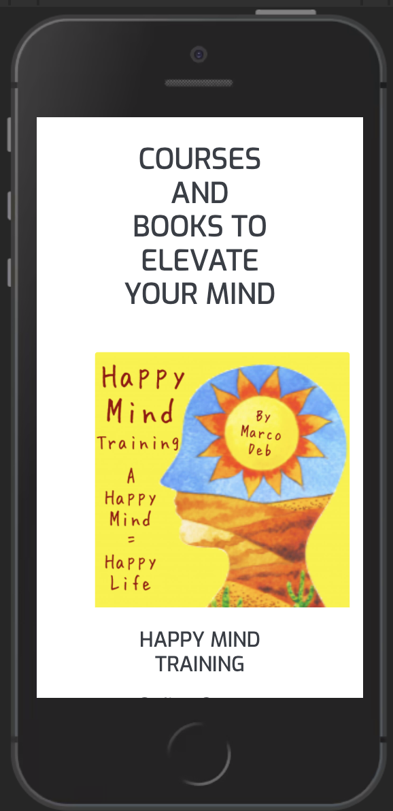
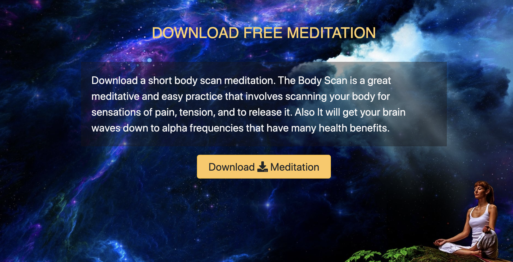
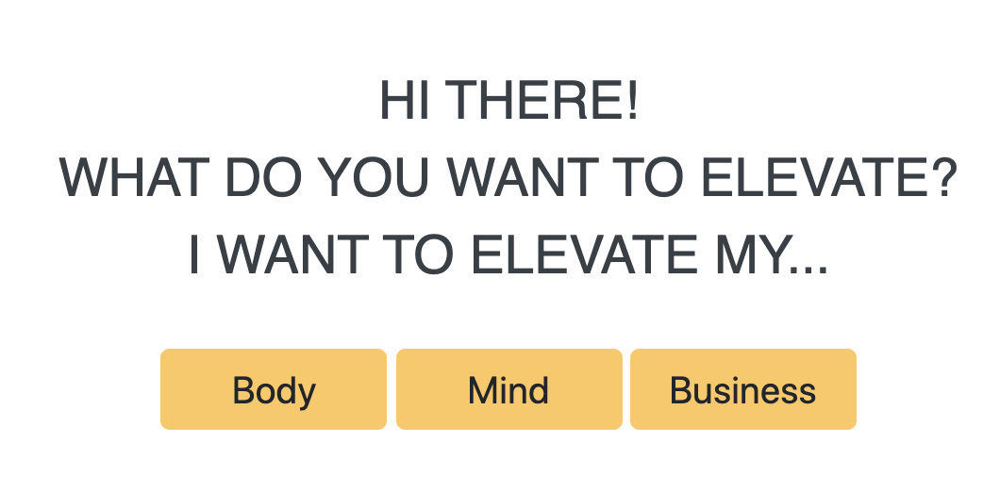
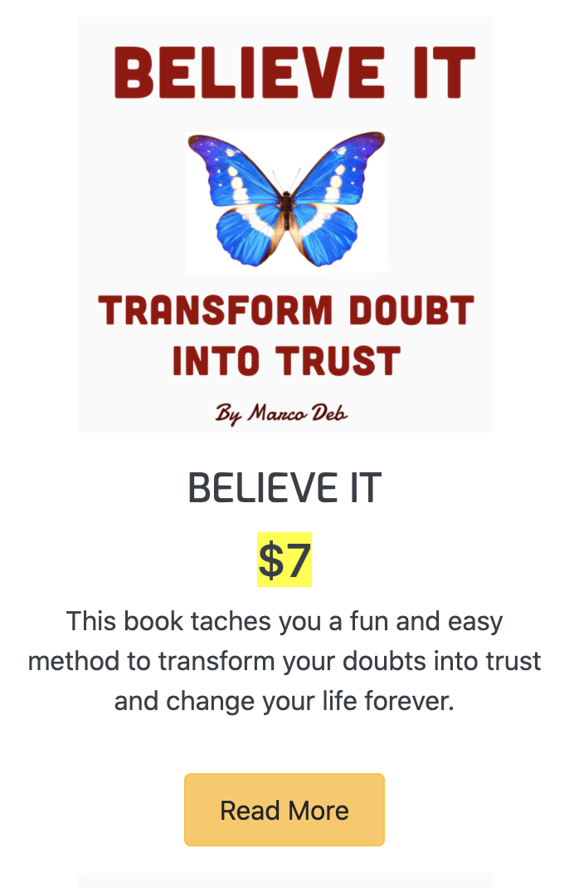
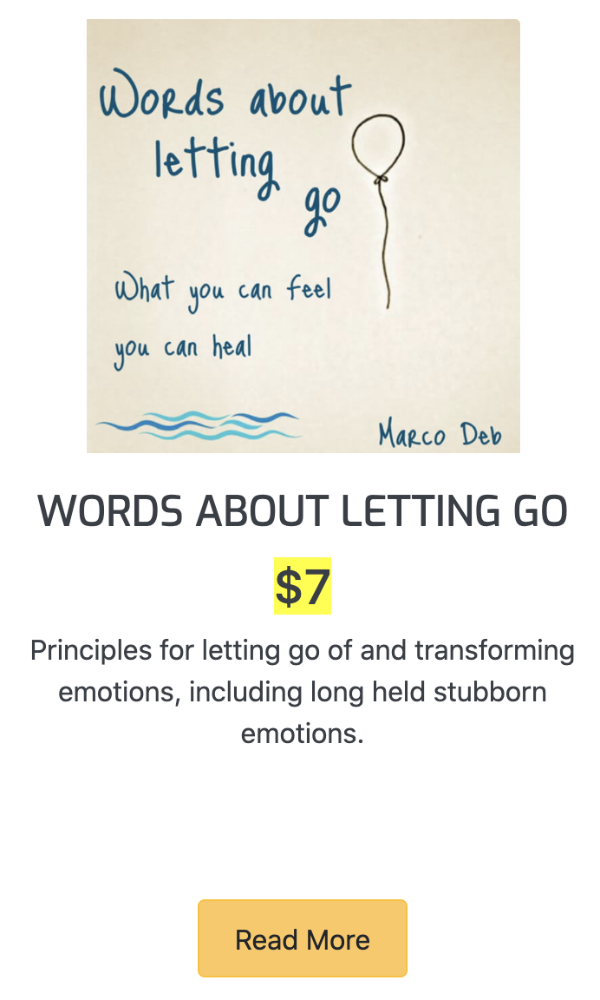
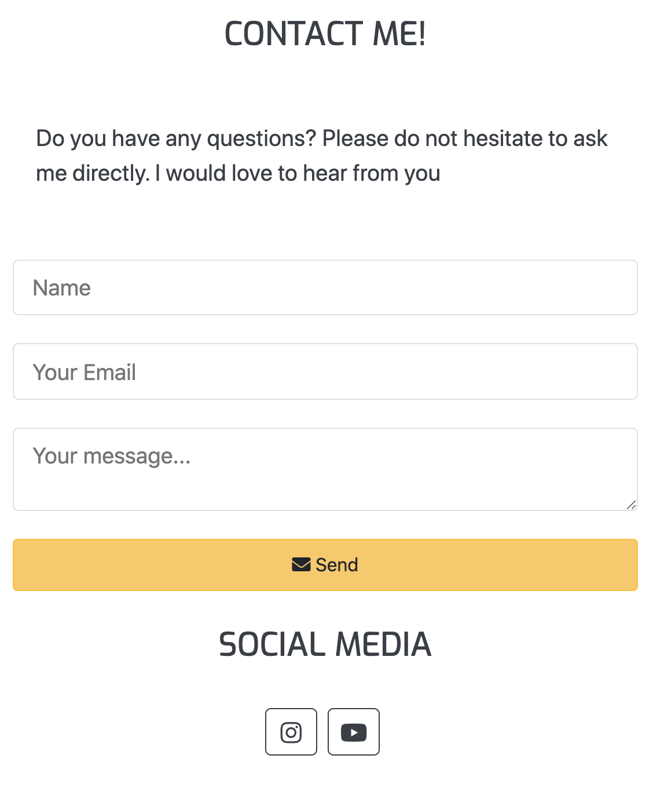

# Marco Deb Website Testing Details

[Main README.md file](README.md)

[View the website in GitHub Pages ](https://github.com/Marc-Solution/marco-deb)

## Table of contents

1. [Browsers tested](#browsers-tested)
2. [Bugs](#Bugs)
3. [Changes made after testing](#changes-made-after-testing)
4. [W3 validator](#w3-validator)
5. [Contact and newsletter forms](#contact-and-newsletter-forms)
6. [Links and buttons](#links-and-buttons)
7. [Alt attribute for images](#alt-attribute-for-images)
8. [Testing the user stories](#testing-the-user-stories)

---

# Browsers tested

- Google Chrome
- Firefox
- Safari
- Opera

I tried these browsers. I looked at all the different sizes in the inspect mode ( Except for in safari, because it does not have that option). It works in widescreen, desktop, tablet and mobile in all browsers except for the Iphone 5/SE in Chrome’s inspect mode. In the quiz section on the home page the cards are not in center as they should when simulating the Iphone 5/SE in Chrome’s inspect mode. ( See image in the bugs section ) I don’t know why it is like that and I don’t know how to fix it.

I have tested it on my laptop computer and also on a big screen. I tested it on two different Iphones and on a Samsung Galaxy. It works as it should on all devises.
I also asked friends to test the website on their mobiles. It all works as it should.

# Bugs

## These are the bugs I found

## 1. The cards in the courses page are not aligned.

I don’t know why it is so. The cards on the upper row and the lower row are not aligned. I have tried to copy the upper row and replacing the lower row and to change the contents of the cards, but it is still unaligned. I did not find a solution to this bug. See image below.

## 2. The Quiz section on the Iphone 5/SE in Chrome’s inspect mode.

The cards are not centered as they should be. All other smartphone models worked well in all the browsers I tested. I don’t know why it is like this and I don’t know how to fix it. See image below.

## 3. Dark theme and light theme buttons.

The buttons for the dark and light theme’s where not aligned. I used bootstrap buttons. I used btn-dark for dark-theme and btn light for light theme. But for some reason they where not aligned. See image below.

I fixed this by using btn-dark for both buttons and then changing the color on the button to light, for light-theme in my style.css file See image below.

## 4. Download meditation in different browsers

There where some issues with the download a meditation service. I tested to fill out the download a meditation form, and I did indeed receive an email containing a download link. So, the EmailJS service works. But there was a problem with downloading using The Firefox browser.

Read below about the different browsers I tested.

### Chrome and Opera browsers:

- In Chrome and Opera the download link works. When you click the link a new tab opens up with a player that starts playing the mp3 file. There’s three dots on the right side of the player that you can click to download the file to your computer. See images below.

### Safari browser:

- In Safari the download link works. When you click the link a new tab opens up with a player that starts playing the mp3 file. You can rightclick the palyer and download the meditation. A meny opens up and you can choose to download it from there. But for some reason it says download video insted of download mp3. I was not able to take a screenshot of this.

### Firefox browser:

In Firefox it doesn’t work. When you click the link the player opens up, but you are not able to download the mp3 file to your computer. But for some reason it works if you copy the link and paste it into the browser. The player will then open up and it is possible to download th mp3 file. I don’t know why it is like this and I don’t know how to solve it. I tested this in two different computers with the same result.

### My solution for this bug:

I created a separate download page and I provided an extra link to that page in to email that the user receives. From this download page there’s a download button. This method works with all the browsers I tested so I am considering to only send this link in the reply email. See the mages below.

# Changes made after testing

When testing the products cards on mobile size and tablet size in Google chrome, Firefox and Opera it looked strange. The text got very stretched out and it didn’t look good. I also tested this on a real Iphone and a Samsung Galaxy with the same result. I solved this by removing the product info text from the card and changed it to a button with the text Read more. This button opens a modal with the product info text.

# W3 validator

#### HTML validator - https://validator.w3.org/

I tested the code in the w3 html validator. I got two errors. The first error was in the what customers say section in the index.html page. The problem was that there was no header directly after the section tag. The header came later in the section. I moved the header so that it comes directly after the section tag. It worked and it was approved.

The second error was in the same section. It had to do with the customer review images. I am not really sure exactly what the second error was. I changed these two things and it got approved.

- The div that contained the customer images had a class attribute but with no value. I removed that class attribute from the div tag.
- Secondly, the hight and width properties for the customer images was in the img tag. I moved the hight and width properties to my style.css.

After doing these changes the code was approved by W3 html validator.

#### CSS validator - https://jigsaw.w3.org/css-validator/

After testing the code in the CSS validator, there were two errors. But this time the errors where not from any code I've written in my workspace. The errors were from the bootstrap library. The errors were found in this link:

https://maxcdn.bootstrapcdn.com/bootstrap/4.2.1/css/bootstrap.min.css

There where also some warnings. Again it was not from any code I’ve written. It came from the bootsnipp code I use for the newsletter. The warning came from this link script https://cdnjs.cloudflare.com/ajax/libs/jquery/3.2.1/jquery.min.js

I wrote to tutor assistance. They said it will be ok as long as I mention it here in this README.

# Links and buttons

- I have tested all the links in the navbar and they work as the should.
- I have tested all the links in the footer. They work as they should. They open up in a new tab. The links go to the company’s Instagram and Facebook pages.
- I have tested all internal links and buttons. They all work as they should.

# Contact and newsletter forms

I tested the contact and newsletter forms.

- When submitting without any message an error message about the required fields appears.
- When submitting with an invalid email address an error message about the required fields appears.
- When submitting the form with all inputs valid a success message opens in a new tab.

# Alt attribute for images

For the banner images on the website I use a div with the image as background. I used the title attribute in the div element containing the banner images to describe the image instead of the alt attribute since an alt attribute won’t work on a div.

Other than that, all images has an alt attribute describing the image.

# Testing the user stories

### User Story item 1:

As a visitor to this website, I want to know what this website can offer me?

Answer:

- The user wants to know what this website can offer them. The banner image on the home page show that this website offer courses, books and meditation within the personal development category.

- The banner image also shows a person meditation in nature. This intended to show the user that this site is about wellbeing and personal development.

- The first section of the home page shows 3 cards that shows the user that this website offers courses, books and meditations.

- The next section of the home page allows the user to download a meditation. This also makes it clear to the user what this website has to offer.

- Lastly before the footer, there is a section that intended to guide the user to find what they are looking for. This sections shows the user that they can find content that will help them to elevate their mind body or business.

See the images below.

### User Story item 2:

As a visitor to this website I want to learn about / improve my health

Answer:

- This website offers several courses books and meditations about improving health.

See images below.

### User Story item 3:

As a visitor to this website I want to learn about / improve my breathing

Answer:

- This website offers a course that teaches you to breathe well.

See the image below.

### User Story item 4:

As a visitor to this website I want to learn about / do meditation

Answer:

- This website offers several meditations. There is a meditations page that the user can navigate to from the navbar and also from other places on the website.
- This site also offers a free meditation that the user can download.

See images below.

### User Story item 5:

As a visitor to this website I want to learn about / improve my Mental health

Answer:

- This website offers books and courses to improve mental health

See the images below.

### User Story item 6:

As a visitor to this website I want to enroll in courses about physical and mental health

Answer:

- This website offers several books and courses about physical and mental health

See the image below.

### User Story item 7:

As a visitor to this website I want to find books about mental training, meditation and health.

Answer:

- This website offers several books, courses and meditations about physical and mental health and personal development.

### User Story item 8:

As a visitor to this website I want to know about product prices.

Answer:

- The price for every product on this website is clearly shown. The price for all products are highlighted with a yellow color.

See the images below.

Product price images.

### User Story item 9:

As a visitor to this website I want to easily navigate this website

Answer:

- The Navbar. The navbar can be found at the top of all pages on this website. From the navbar, the user can navigate to all pages on this website on this website, except the terms page, privacy policy page and the download page. See the images below.

Navbar: Laptop version

Navbar: Mobile version

- The footer. The footer can be found in the bottom af all pages on this website. In the footer there are links to all pages on the website, including to the terms page and the privacy policy page, except for the contact page. There no link to the contact page in the footer because there is a contact form in the footer. See the images below.

Footer image.

- There’s no link to the download page on this website because the user is supposed to receive a link to this page after they have filled in their name and email address in the download meditation section. See the images below.

- From the navbar the visitor can navigate to three different product pages. Courses, Books and Meditations. From these pages the visitor can find all the products that this website has to offer.

  - The Courses page shows the visitor all the different courses.
  - The Books page shows the visitor all the different books.
  - The Meditations page shows the visitor all the different meditations.

- The Banner image contains links to the Courses, Books and Meditation pages to help the visitor navigate. See image below.

Banner image links.

- Product overview. The next section on the home page right after the banner is a product overview. It shows that this website has courses, books and meditations to offer to the visitor. See the image below.

Products section image.

- Customer guide section. In the bottom of the home page just before the footer there is a section intended to guide the visitor to find what they’re looking for. There are three categories that the visitor can choose from. The categories are Mind, body and business. Each category has a button that the user can click. When they click one of the categories, a div opens up with different products that matches the chosen category. See the image below.

Customer Guide Image.

### User Story item 10:

As a visitor to this website I want to know a little bit about Marco Deb

Answer:

- If the user wants to know about Marco Deb they can find the About page in the navbar or in the footer. There's also links to Marco's social media channels where they can learn more.

  

### User Story item 11:

As a visitor to this websiteI want to contact Marco Deb

Answer:

- To contact Marco Deb the user can find a link in the navbar to the contact page. There’s also a contact form in the footer on all pages. The visitor can also contact Marco via his social media channels. There are links in the footer, the About and contact pages to Marco’s social media channels. See images Below.

  
  
  
